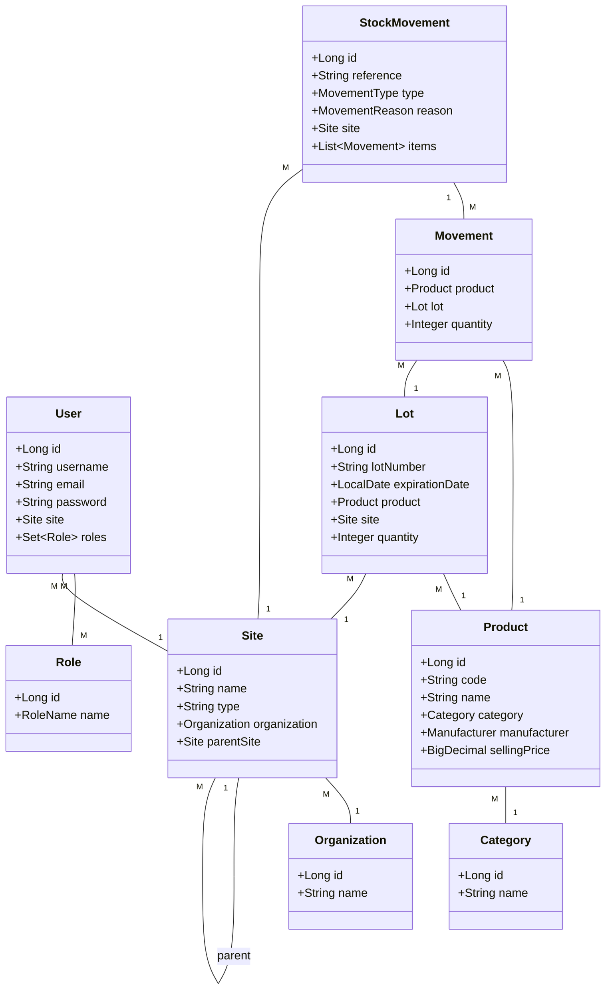
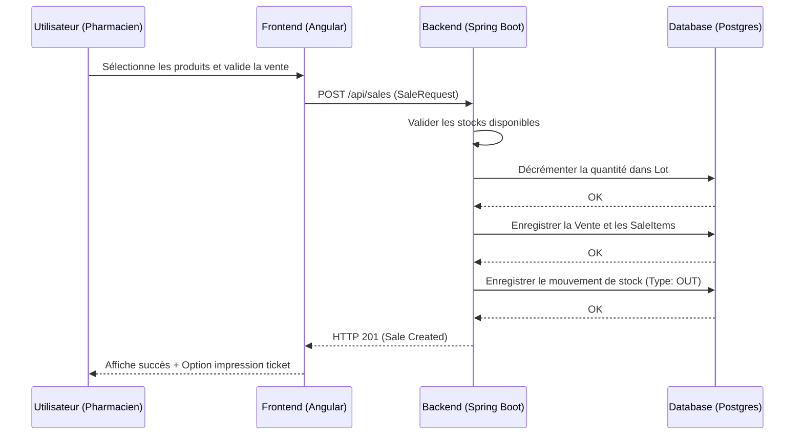
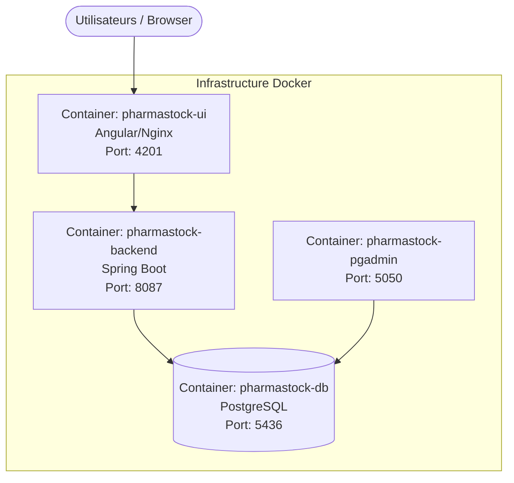

# FasoPharma - Gestion de Stock Pharmaceutique Multi-sites

FasoPharma est une plateforme web moderne et sécurisée conçue pour la gestion des stocks de produits pharmaceutiques à travers plusieurs sites (Dépôts, Pharmacies, Services). Elle permet un suivi rigoureux des mouvements de stocks, des ventes, des inventaires et des alertes de péremption.

## 🛠️ Stack Technique

- **Backend** : Java 17, Spring Boot 3.2.5, Spring Security, JPA/Hibernate.
- **Frontend** : Angular 17.3, Angular Material, RxJS.
- **Base de données** : PostgreSQL 15.
- **Reporting** : OpenPDF, Apache POI (Export PDF et Excel).
- **Docker** : Docker Compose pour l'orchestration des services.

---

## 📊 Diagrammes du Système

### 1. Diagramme de Classe (Cœur Métier)



### 2. Diagramme de Séquence (Processus de Vente/Sortie)



### 3. Diagramme de Déploiement



---

## 🚀 Installation et Démarrage

### Prérequis
- Docker et Docker Compose installés.
- Java 17+ (pour le développement local).
- Node.js 18+ (pour le développement frontend).

### Lancement avec Docker
1. Clonez le dépôt.
2. À la racine du projet, lancez :
   ```bash
   docker-compose up --build
   ```
3. Accédez à l'application :
   - Frontend : `http://localhost:4201`
   - Backend API : `http://localhost:8087/api`
   - pgAdmin : `http://localhost:5050` (admin@admin.com / admin)

### Comptes par défaut (Initialisation)
- **Admin** : admin / admin123
- **Pharmacien** : pharma / pharma123

## 🔒 Sécurité et Performance
- Authentification par **JWT (Stateless)**.
- **CORS** restreint aux domaines autorisés.
- **Rate Limiting** sur les tentatives de connexion.
- **Pagination côté serveur** pour toutes les listes volumineuses.
- **Indexation** SQL sur les colonnes de recherche (codes, numéros de lots).
