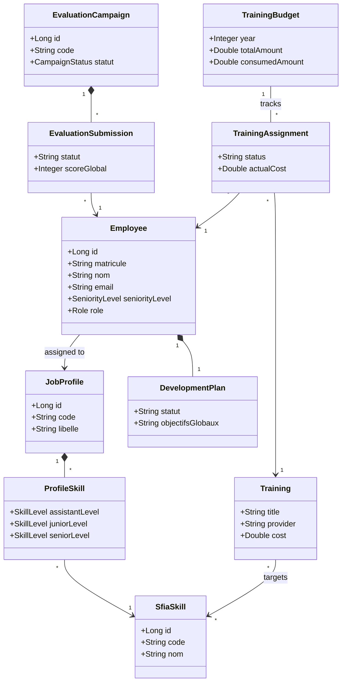
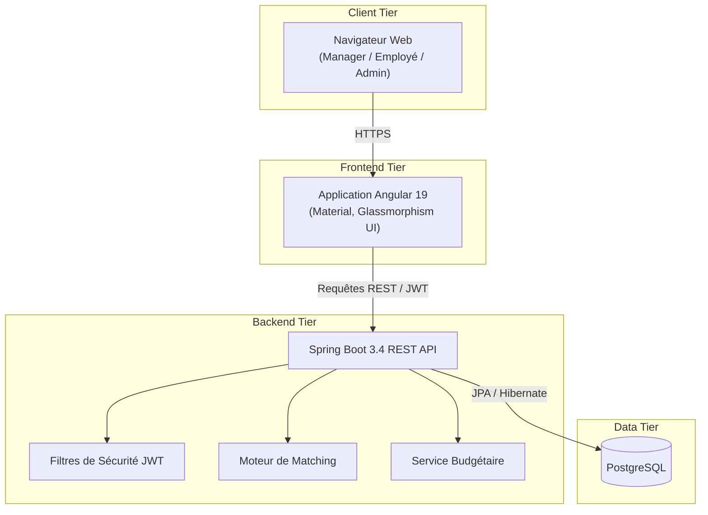

# Référentiel de Compétences IT — DGTD

Application de gestion stratégique des compétences IT basée sur le framework SFIA, conçue pour piloter la trajectoire professionnelle des collaborateurs de la Direction Générale du Trésor et de la Comptabilité Publique (DGTD).

---

## 🗺️ Roadmap & État d'avancement

| Niveau | Module | Statut |
|--------|--------|--------|
| N1–N5 | Socle, Auto-évaluation, Dashboard, Validation, PDI | ✅ Complété |
| N6 | Catalogue de Formations & Recommandations | ✅ Complété |
| N7 | Moteur de Matching (Mobilité Interne) | ✅ Complété |
| N8 | Gestion des Successions (Talent Pool) | ✅ Complété |
| N9 | Pilotage Stratégique IT + Budget Formations | ✅ Complété |
| N10 | Intégration Badgeur / IA | 🔮 Futur |

---

## 🚀 Fonctionnalités Premium

### 📚 N6 — Catalogue de Formations & Recommandations
- **Catalogue centralisé** : Gestion CRUD des formations (titre, prestataire, durée, coût unitaire, compétences cibles SFIA).
- **Coût unitaire** : Chaque formation dispose d'un coût estimé en FCFA, utilisé pour alimenter le suivi budgétaire.
- **Recommandations automatiques** : Le Plan de Développement Individuel (PDI) suggère automatiquement les formations les plus pertinentes en fonction des écarts de compétences détectés lors de l'évaluation.

### 🔄 N7 — Moteur de Matching & Mobilité Interne
- **Score d'adéquation** : Calcul d'un pourcentage de compatibilité entre le profil d'un collaborateur et n'importe quel poste cible du référentiel.
- **Analyse des écarts détaillée** : Visualisation compétence par compétence du niveau actuel vs. le niveau requis.
- **Simulation de mobilité** : Outil permettant aux RH et Managers de tester des scénarios de mobilité avant décision (accessible via */mobilite*).

### 🛡️ N8 — Gestion des Successions (Talent Pool)
- **Identification des successeurs** : Pour chaque poste clé, le système identifie et classe automatiquement les Top 5 candidats internes par score de préparation.
- **Badges de rang** : Visualisation Or / Argent / Bronze des meilleurs talents pour une prise de décision rapide.
- **Filtrage par séniorité** : Recherche de successeurs par niveau requis (Assistant, Junior, Senior).
- **Accès sécurisé** : Réservé aux Administrateurs pour assurer la confidentialité des données de succession.

### 📈 N9 — Pilotage Stratégique IT
- **Analyse des risques critiques** : Identification automatique des 5 compétences au plus fort écart collectif (skills gaps organisationnels).
- **Indice de maturité par famille** : Taux de couverture moyen des compétences par famille de métiers IT (ex: Cybersécurité, Développement, Data...).
- **Préconisations automatiques** : Suggestions d'actions prioritaires basées sur les données réelles (formation, mentorat croisé).
- **Widget budgétaire intégré** : Visualisation de l'état de l'enveloppe annuelle de formation directement dans le tableau de bord stratégique.

### 💰 Suivi Budgétaire des Formations
- **Enveloppe annuelle** : Définition et mise à jour du budget global alloué aux formations pour chaque année.
- **Suivi de la consommation** : Chaque inscription d'un employé à une formation incrémente automatiquement le montant engagé.
- **Indicateurs financiers clés** : Total alloué, Montant consommé, Solde disponible, Taux de consommation (en %).
- **Alerte de dépassement** : La barre de progression passe au rouge automatiquement lorsque le taux dépasse 90%.
- **Double accès** :
  - **Admin** → onglet "Budget" dans l'Administration (lecture + écriture).
  - **Manager/Direction** → widget en lecture seule dans le Pilotage Stratégique.

---

## 🔍 Autres Fonctionnalités

### 📊 Export Excel Haute Performance
- **Format Premium** : Génération de matrices de compétences au format `.xlsx` avec enrichissement stylistique complet (couleurs thématiques, typographie Calibri, bordures soignées).
- **Lisibilité Maximale** : Volets figés (ligne d'en-tête et colonnes noms/codes), filtres automatiques activés et ajustement dynamique des largeurs de colonnes.
- **Code Couleur Intelligent** : Mise en évidence visuelle immédiate des niveaux (Avancé en vert, Intermédiaire en orange, Débutant en bleu).
- **Exhaustivité** : Algorithme d'export garantissant l'inclusion de tous les collaborateurs et toutes les compétences du référentiel.

### 🔍 Recherche et Navigation
- **Omni-recherche par Matricule** : Champs de recherche instantanée dans les interfaces de **Gestion des Utilisateurs** et de **Validation Manager**.
- **Filtrage Intelligent** : Filtre simultané sur les noms, prénoms et numéros matricules.

### ⚙️ Administration et Gouvernance
- **Cycle de Vie des Campagnes** : Gestion complète des statuts (PLANIFIÉE, EN COURS, CLÔTURÉE).
- **Gestion Granulaire des Rôles** : Modification dynamique des permissions (EMPLOYEE, MANAGER, RH, ADMIN).
- **Intégrité des Données** : Système robuste avec protection contre les erreurs de rendu Angular.

---

## Modélisation et Diagrammes

### Diagramme de Classes



### Diagramme de Déploiement



## Architecture backend (MVC)

```
bf.gov.dgtd.skills/
├── model/
│   ├── entity/               # Entités JPA (Employee, Training, TrainingBudget, TrainingAssignment...)
│   ├── repository/           # Accès données Spring Data JPA
│   ├── dto/                  # Objets de transfert (TrainingDto, BudgetDto, MatchingDto...)
│   └── enums/                # SkillLevel (0-3), SeniorityLevel, Role...
├── service/                  # Logique métier
│   ├── MatchingService       # Moteur de calcul d'adéquation et succession
│   ├── BudgetService         # Suivi financier des formations
│   ├── DashboardService      # Statistiques RH + pilotage stratégique
│   ├── TrainingService       # CRUD catalogue de formations
│   └── mapper/               # EntityMapper (conversions entité ↔ DTO)
├── controller/               # Contrôleurs REST
│   ├── MatchingController    # /api/matching/**
│   ├── BudgetController      # /api/budget/**
│   ├── TrainingController    # /api/trainings/**
│   └── DashboardController   # /api/dashboard/**
├── config/                   # Sécurité JWT, DataSeeder
└── exception/
```

## Stack Technique

- **Frontend** : Angular 19, Angular Material (Design : Glassmorphism, dégradés, ombres douces)
- **Backend** : Spring Boot 3.4, JWT Security
- **Base de données** : PostgreSQL / JPA Hibernate
- **Export Excel** : `xlsx-js-style` (Supporte les styles riches côté client)
- **Export PDF** : Apache PDFBox

## Démarrage

```bash
# Backend
cd backend && mvn spring-boot:run

# Frontend
cd frontend
cp .env.example .env   # puis adapter si besoin
npm start              # lit .env avant ng serve
```

## Première visite (Onboarding)

Parcours sans compte préalable : saisie du matricule → complétion du profil → création automatique du compte → connexion JWT → redirection vers l'auto-évaluation.

| Étape | URL / API |
|-------|-----------|
| Assistant | `/onboarding` |
| Vérification matricule | `POST /api/onboarding/lookup` |
| Finalisation | `POST /api/onboarding/complete` |

**Matricules de test** : `M00125`, `M00200`, `M00315`.  
**Matricule déjà enregistré** : `EMP001` (compte `arnaud.kiema@dgtd.bf`).

## API Complète

| Domaine | Endpoints |
|---------|-----------|
| Auth | `POST /api/auth/login` |
| Onboarding | `POST /api/onboarding/lookup`, `/complete` |
| Profil | `GET/PUT /api/me/profile` |
| Évaluation | `GET/PUT /api/assessments/me`, `GET .../gap-analysis` |
| Campagnes | `GET /api/campaigns/active`, `POST /api/campaigns/submit` |
| Validation | `GET /api/campaigns/submissions/pending`, `POST .../validate` |
| PDF | `GET /api/reports/me/pdf`, `/employees/{id}/pdf` |
| Dashboard | `GET /api/dashboard/summary`, `/manager`, `/matrix`, `/strategic` |
| Formations | `GET/POST/PUT/DELETE /api/trainings`, `GET .../suggest?skillIds=` |
| Matching | `POST /api/matching/calculate`, `GET .../top-candidates` |
| Budget | `GET /api/budget/{year}`, `POST /api/budget/allocation`, `POST /api/budget/assign` |
| Admin | `CRUD /api/admin/families`, `/skills`, `/profiles`, `/profile-skills` |
| Import RH | `POST /api/admin/employee-master/import` |

## Modules Frontend

| Module | Description |
|--------|-------------|
| **`auth`** | Authentification JWT, état connecté, déconnexion. |
| **`onboarding`** | Wizard de première connexion, vérification matricule, création de compte. |
| **`assessments`** | Auto-évaluation SFIA, scores par compétence, analyse des gaps. |
| **`campaigns`** | Soumission des auto-évaluations (`my-campaign`) et validation manager (`validation`). |
| **`dashboard`** | Vue Manager, Matrice des compétences, Dashboard RH, **Pilotage Stratégique** (gaps collectifs + budget). |
| **`employees`** | Profil personnel, trajectoire, PDI avec recommandations de formations. |
| **`pdi`** | Plan de Développement Individuel avec actions et formations recommandées automatiquement. |
| **`admin`** | Référentiel CRUD, Matrice profil↔compétence, Campagnes, Import RH, Formations + **Suivi Budgétaire**. |
| **`admin/matching`** | Simulation de mobilité interne avec score d'adéquation et analyse des écarts. |
| **`admin/succession`** | Identification des successeurs Top 5 pour les postes critiques (réservé Admin). |

## Fonctionnalités par Rôle

### 👤 Collaborateur
- Auto-évaluation SFIA dynamique avec niveaux (Débutant → Expert).
- Suivi de la trajectoire par rapport au profil cible.
- Plan de Développement Individuel (PDI) avec formations recommandées.
- Export PDF individuel du référentiel de compétences.

### 👥 Manager / RH
- **Dashboard Analytique** : Vue d'ensemble des scores et taux de couverture de l'équipe.
- **Matrice des Compétences** : Tableau croisé exportable au format Excel.
- **Validation des Soumissions** : Révision, commentaire, approbation ou rejet des auto-évaluations.
- **Simulation de Mobilité** : Test d'adéquation collaborateur ↔ poste cible avec score en %.
- **Pilotage Stratégique** : Analyse des risques IT collectifs et suivi du budget de formation.

### 🛠️ Administrateur
- Gestion complète du référentiel : Familles, Compétences SFIA, Profils métiers.
- Paramétrage de la matrice profil ↔ compétence (niveaux par séniorité).
- Gestion centralisée des rôles et des comptes (EMPLOYEE, MANAGER, RH, ADMIN).
- Catalogue de formations avec coûts unitaires.
- **Suivi budgétaire** : Définition des enveloppes annuelles et suivi de la consommation.
- **Plan de succession** : Identification des Top 5 talents pour chaque poste clé.
- Importation massive de données RH (CSV Employee Master).

## Comptes de démonstration

| Rôle | E-mail | Mot de passe |
|------|--------|--------------|
| Employé | arnaud.kiema@dgtd.bf | employee123 |
| Manager | manager@dgtd.bf | manager123 |
| RH | rh@dgtd.bf | rh123 |
| Admin | admin@dgtd.bf | admin123 |

---

## Évolutions Futures (N10)

- Intégration LDAP / Active Directory pour l'authentification SSO.
- Moteur de recommandation IA pour les formations.
- JasperReports pour les rapports avancés.
- Intégration Badgeur pour la certification automatique des compétences.

---
*Projet développé pour la Direction Générale du Trésor et de la Comptabilité Publique (DGTD) — Burkina Faso.*
